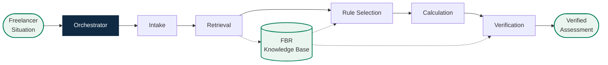
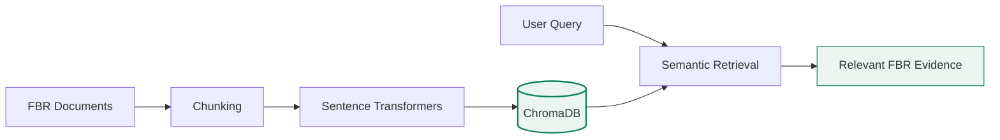

# FBR FreelanceGuide 🇵🇰

### AI-Powered Multi-Agent Tax Reasoning & Verification for Pakistani Freelancers

> **From Tax Complexity to Clarity — Powered by AI.**

FBR FreelanceGuide is a specialized **multi-agent AI system** that helps Pakistani freelancers reason through applicable tax treatment using **official FBR evidence, rule selection, deterministic calculation, and independent verification**.

###  [Try the Live Demo](https://fbr-freelanceguide-2026.streamlit.app/)

---

##  Problem

Freelancers can find tax information, but determining **which rule applies to their specific circumstances** can still require navigating multiple provisions, conditions, and rates.

FreelanceGuide focuses on turning that complexity into a structured, evidence-backed reasoning process.

---

##  Multi-Agent Architecture

| Agent | Responsibility |
|---|---|
| **Orchestrator** | Coordinates the assessment workflow |
| **Intake** | Extracts tax-relevant facts |
| **Retrieval** | Retrieves relevant FBR evidence |
| **Rule Selection** | Evaluates conditions and selects applicable treatment |
| **Calculation** | Performs deterministic calculations |
| **Verification** | Independently validates the assessment |

---

##  Knowledge Base

The system uses a curated FBR knowledge base containing:

- **Income Tax Ordinance 2001**
- **Finance Act 2026**
- **Withholding Tax Rates Card 2027**

---

##  Key Features

- **Multi-Agent Reasoning** — specialized agents with clearly separated responsibilities
- **FBR-Grounded RAG** — evidence retrieved from official FBR documents
- **Eligibility-Aware Rule Selection** — conditions evaluated before treatment selection
- **Deterministic Calculation** — numerical logic separated from language generation
- **Independent Verification** — dedicated cross-checking stage
- **Caveat Detection** — missing or uncertain information is surfaced
- **Source Traceability** — supporting documents and page references

---

##  Tech Stack

**Python** · **Streamlit** · **Groq** · **ChromaDB** · **Sentence Transformers** · **PyMuPDF** · **Pydantic**

### Multi-Agent Layer

`Orchestrator → Intake → Retrieval → Rule Selection → Calculation → Verification`

---

##  Disclaimer

FBR FreelanceGuide is an **AI-assisted research and reasoning tool**, not an official FBR service or a substitute for professional tax advice. Users should verify important tax decisions against current FBR requirements or with a qualified professional.

---

### 🇵🇰 Built for Pakistan's Digital Workforce

**Understand. Calculate. Verify.**

> *From Tax Complexity to Clarity — Powered by AI.*
