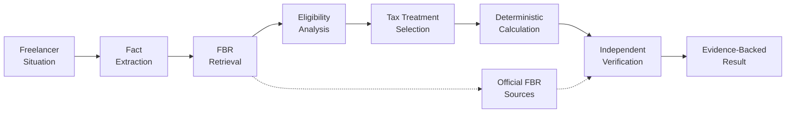
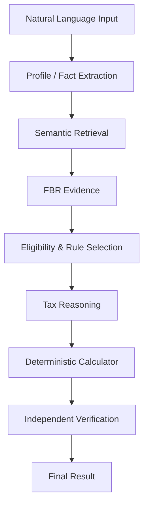

# FBR FreelanceGuide 🇵🇰

### AI-Powered Tax Reasoning & Verification for Pakistani Freelancers

[](https://fbr-freelanceguide-2026.streamlit.app/)
[](https://www.python.org/)
[](#how-it-works)
[](#knowledge-base)
[](https://streamlit.io/)

> **FBR FreelanceGuide** is an AI-powered tax reasoning and verification platform built for Pakistani freelancers. It combines **FBR-grounded RAG, eligibility-aware reasoning, deterministic calculations, and independent verification** to turn a freelancer's situation into an evidence-backed tax analysis.

### 🚀 [Try the Live Demo](https://fbr-freelanceguide-2026.streamlit.app/)

---

## Why FBR FreelanceGuide?

Pakistani freelancers often have to navigate complex tax rules across the **Income Tax Ordinance, Finance Acts, withholding tax rates, and FBR guidance**.

The problem isn't simply finding information.

It's determining:

- Which FBR provision applies to a specific freelancer
- Which conditions are relevant
- Which rate should actually be applied
- How much tax follows from that treatment
- Whether the conclusion is supported by official evidence

**FBR FreelanceGuide turns this into a structured AI-assisted reasoning workflow.**

---

## How It Works



### The pipeline

**1. Understand**  
Extract tax-relevant facts from the freelancer's natural-language description.

**2. Retrieve**  
Search the FBR-grounded knowledge base for relevant provisions, rates, and conditions.

**3. Reason**  
Match the user's circumstances against the retrieved FBR evidence.

**4. Calculate**  
Apply the selected rate using deterministic calculation logic.

**5. Verify**  
Independently check the treatment, rate, conditions, arithmetic, and supporting evidence.

**6. Explain**  
Return the result with source references and clearly identified caveats.

---

## Key Features

| Feature | Description |
|---|---|
| 🧠 **AI Tax Reasoning** | Understands a freelancer's situation in natural language |
| 📚 **FBR-Grounded RAG** | Retrieves evidence directly from incorporated FBR documents |
| ⚖️ **Eligibility Analysis** | Considers taxpayer-specific conditions before selecting treatment |
| 🧮 **Deterministic Calculation** | Keeps numerical tax calculations outside the LLM |
| 🔍 **Independent Verification** | Checks the proposed treatment and calculation separately |
| ⚠️ **Caveat Detection** | Identifies missing or unconfirmed taxpayer information |
| 📄 **Source Traceability** | Shows supporting FBR documents and page references |

---

## Knowledge Base

The system is grounded in official FBR tax material, including:

- **Income Tax Ordinance 2001**
- **Finance Act 2026**
- **Withholding Tax Rates Card 2027**

```text
data/
└── fbr/
    └── documents/
        ├── IncomeTaxOrdinance2001.pdf
        ├── FinanceAct2026.pdf
        └── WithholdingTaxRatesCard2027.pdf
```

The documents are processed into searchable chunks, embedded using **Sentence Transformers**, and stored in **ChromaDB** for semantic retrieval.

---

## AI Architecture



### Design Principle

> **LLMs reason over tax rules. Deterministic logic performs the arithmetic.**

This separation reduces the risk of an LLM inventing or incorrectly calculating a tax amount.

---

## Example

### Freelancer Profile

```text
Profession        → Software Developer
Clients           → United States
Annual Proceeds   → PKR 4,800,000
PSEB Registered   → No
Payment           → Foreign currency → Pakistani bank account
```

### Generated Analysis

```text
Tax Treatment
Section 154A – Export of Services

Applicable Branch
Non-PSEB registered IT / IT-enabled services

Applied Rate
1%

Estimated Amount
PKR 48,000

Verification
VERIFIED WITH CAVEAT
```

The system also identifies required conditions that have **not been explicitly confirmed**, rather than silently assuming them.

---

## Tech Stack

**Frontend**

`Streamlit`

**AI / LLM**

`Groq`

**RAG**

`ChromaDB` · `Sentence Transformers`

**Document Processing**

`PyMuPDF`

**Validation**

`Pydantic`

**Language**

`Python`

**Deployment**

`Streamlit Community Cloud`

---

## Project Structure

```text
FBR-FreelanceGuide/
│
├── agents/                 # AI reasoning & verification
├── data/
│   └── fbr/
│       └── documents/      # FBR source documents
│
├── rag/                    # Retrieval & vector search
├── ui/                     # Streamlit UI components
├── utils/                  # Supporting utilities
│
├── app.py                  # Application entry point
├── requirements.txt
└── README.md
```

---

## Run Locally

```bash
git clone https://github.com/ayeshakhawar217-cmd/FBR-FreelanceGuide.git

cd FBR-FreelanceGuide

pip install -r requirements.txt

streamlit run app.py
```

Add your API credentials through environment variables/secrets before running the application.

---

## Deployment

The application is currently deployed on **Streamlit Community Cloud**.

### 🔴 Live Application

**https://fbr-freelanceguide-2026.streamlit.app/**

---

## Limitations

FBR FreelanceGuide is an **AI-assisted decision-support system**, not an official FBR service or a substitute for professional tax advice.

Tax treatment may depend on facts that are unavailable to the system, changes in legislation, updated FBR notifications, or taxpayer-specific circumstances.

For this reason, the system is designed to **surface uncertainty instead of hiding it**.

---

## Built For

**FBR AI Transformation & Innovation Challenge**

### Team FBR FreelanceGuide 🇵🇰

---

<p align="center">

**Making tax reasoning simpler, evidence-backed, and accessible for Pakistan's growing freelance economy.**

<br>

<a href="https://fbr-freelanceguide-2026.streamlit.app/">
  <strong>🚀 Launch FBR FreelanceGuide</strong>
</a>

</p>
