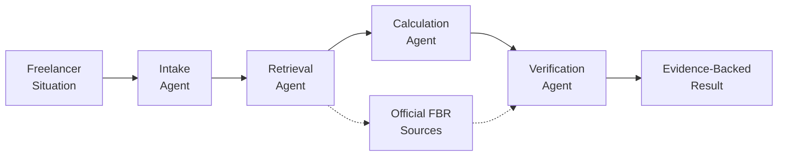
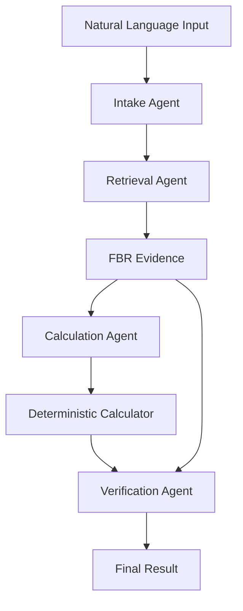

# FBR FreelanceGuide 🇵🇰

### AI-Powered Multi-Agent Tax Reasoning & Verification for Pakistani Freelancers

[](https://fbr-freelanceguide-2026.streamlit.app/)
[](https://www.python.org/)
[](#multi-agent-architecture)
[](#knowledge-base)
[](#knowledge-base)
[](https://streamlit.io/)

> **FBR FreelanceGuide** is a **multi-agent AI tax reasoning and verification platform** built for Pakistani freelancers. It combines specialized AI agents, **FBR-grounded RAG, eligibility-aware reasoning, deterministic calculations, and independent verification** to turn a freelancer's situation into an evidence-backed tax analysis.

### 🚀 [Try the Live Demo](https://fbr-freelanceguide-2026.streamlit.app/)

---

## Why FBR FreelanceGuide?

Pakistani freelancers often have to navigate complex tax rules across the **Income Tax Ordinance, Finance Acts, withholding tax rates, and FBR guidance**.

The problem isn't simply finding information.

It's determining:

- Which FBR provision applies to a specific freelancer
- Which conditions are relevant
- Which rate should actually be applied
- How much tax follows from that treatment
- Whether the conclusion is supported by official evidence

**FBR FreelanceGuide uses a specialized multi-agent architecture to turn this into a structured, evidence-backed reasoning process.**

---

## How It Works



### The Multi-Agent Pipeline

**1. Intake Agent — Understand**  
Extracts tax-relevant facts from the freelancer's natural-language description.

**2. Retrieval Agent — Retrieve**  
Searches the FBR-grounded knowledge base for relevant provisions, rates, and conditions.

**3. Calculation Agent — Reason & Calculate**  
Evaluates the retrieved rules against the user's circumstances, identifies the applicable treatment, and performs the deterministic calculation.

**4. Verification Agent — Verify**  
Independently cross-checks the treatment, rate, calculation, conditions, and supporting evidence.

**Final Output — Explain**  
Presents the assessment with source references, verification status, and clearly identified caveats.

---

## Key Features

| Feature | Description |
|---|---|
| 🤖 **Multi-Agent Architecture** | Specialized agents divide intake, retrieval, calculation, and verification responsibilities |
| 🧠 **AI Tax Reasoning** | Understands a freelancer's situation in natural language |
| 📚 **FBR-Grounded RAG** | Retrieves evidence directly from incorporated FBR documents |
| ⚖️ **Eligibility Analysis** | Considers taxpayer-specific conditions before selecting treatment |
| 🧮 **Deterministic Calculation** | Keeps numerical tax calculations outside free-form LLM generation |
| 🔍 **Independent Verification** | Separately checks the proposed treatment and calculation |
| ⚠️ **Caveat Detection** | Identifies missing or unconfirmed taxpayer information |
| 📄 **Source Traceability** | Shows supporting FBR documents and page references |

---

## Knowledge Base

The system is grounded in official FBR tax material, including:

- **Income Tax Ordinance 2001**
- **Finance Act 2026**
- **Withholding Tax Rates Card 2027**

```text
data/
└── fbr/
    └── documents/
        ├── IncomeTaxOrdinance2001.pdf
        ├── FinanceAct2026.pdf
        └── WithholdingTaxRatesCard2027.pdf
```

The documents are processed into searchable chunks, embedded using **Sentence Transformers**, and stored in **ChromaDB** for semantic retrieval.

---

## Multi-Agent Architecture

FBR FreelanceGuide separates tax reasoning into specialized agents rather than relying on a single model response.

| Agent | Responsibility |
|---|---|
| **Intake Agent** | Converts natural-language input into structured tax-relevant facts |
| **Retrieval Agent** | Retrieves relevant FBR provisions, rates, and evidence |
| **Calculation Agent** | Applies the identified treatment and performs deterministic calculations |
| **Verification Agent** | Independently validates the assessment against retrieved FBR evidence |

### Design Principle

> **One model can generate an answer. Specialized agents can divide responsibility, verify reasoning, and make the result more traceable.**

The architecture separates **understanding, evidence retrieval, calculation, and verification**, reducing dependence on a single generated response.

---

## AI Architecture



### Core Design Principle

> **LLMs reason over tax rules. Deterministic logic performs the arithmetic. Independent verification checks the result against the evidence.**

---

## Tech Stack

- **Language:** Python
- **Frontend & Deployment:** Streamlit · Streamlit Community Cloud
- **LLM:** Groq
- **Multi-Agent Architecture:** Specialized Intake · Retrieval · Calculation · Verification Agents
- **RAG & Vector Search:** ChromaDB · Sentence Transformers
- **Document Processing:** PyMuPDF
- **Validation & Configuration:** Pydantic · python-dotenv
- **Knowledge Base:** FBR Income Tax Ordinance 2001 · Finance Act 2026 · Withholding Tax Rates Card 2027

---

## Limitations

FBR FreelanceGuide is an **AI-assisted decision-support system**, not an official FBR service or a substitute for professional tax advice.

Tax treatment may depend on facts that are unavailable to the system, changes in legislation, updated FBR notifications, or taxpayer-specific circumstances.

For this reason, the system is designed to **surface uncertainty instead of hiding it**.

---

## Built For

**PakAngels AI Transformation & Innovation Hackathon**

---

<p align="center">

**Making tax reasoning simpler, evidence-backed, and accessible for Pakistan's growing freelance economy.**

</p>
